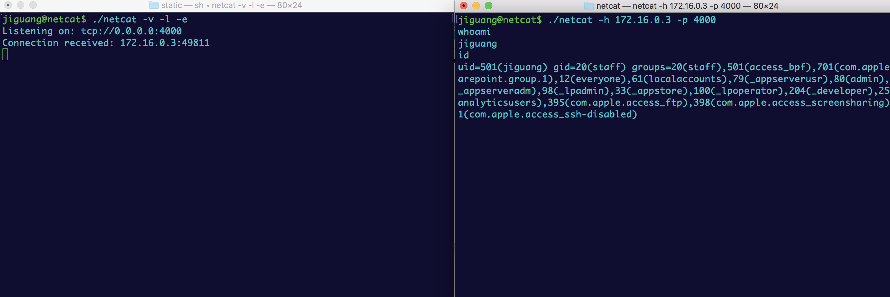
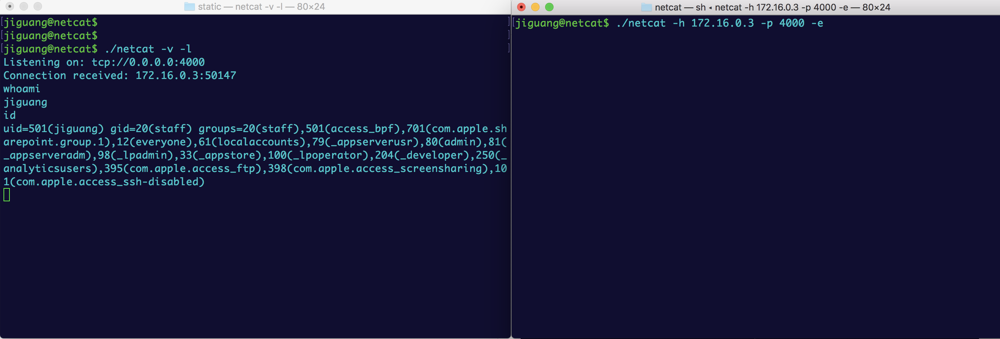
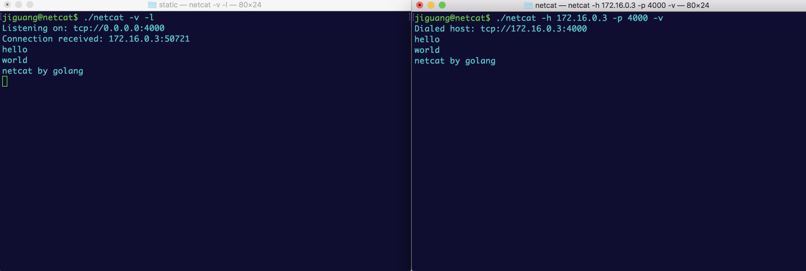

### Netcat介绍

`Netcat` 号称 TCP/IP 的瑞士军刀并非浪得虚名，以体积小（可执行 200KB）功能灵活而著称，在各大发行版中都默认安装，你可以用它来做很多网络相关的工作，熟练使用它可以不依靠其他工具做一些很有用的事情。

最初作者是叫做“霍比特人”的网友 Hobbit <hobbit@avian.org> 于 1995 年在 UNIX 上以源代码的形式发布，Posix 版本的 netcat 主要有 GNU 版本的 netcat 和 OpenBSD 的 netcat 两者都可以在 debian/ubuntu 下面安装，但是 Windows 下面只有 GNU 版本的 port。

### 在Go中创建Netcat应用

`Netcat`在安全测试尤其是渗透测试过程中经常用到，比如在内网中需要上传下载文件，命令执行等功能都可能用到。
基于Go语言内置的`net`库编写`netcat`应用，需要实现的功能点有：

- 发起TCP/UDP连接
- 监听TCP端口
- 监听UDP端口
- 处理标准输入输出流
- 命令执行功能
- 字符编码转换[windows命令执行结果因为GBK编码问题可能会出现乱码]

#### 发起TCP/UDP连接

使用标准库的`net.Dial`方法根据传入参数发起一个`TCP/UDP`连接请求：

```
//@param [string] [host] - 连接对方主机的IP地址
//@param [int] [port] - 连接对方的主机的端口
//@param [net.Conn] [conn] - 根据建立的conn连接管道，就可以向对方发送数据与接受对方数据，
//比如文件传输，文件下载，命令反弹，标准输入/输出流传送等
dailAddr := net.JoinHostPort(host, strconv.Itoa(port))
conn, err := net.Dial(network, dailAddr)
if err != nil {
    logf("Dail failed: %s", err)
    return
}
logf("Dialed host: %s://%s",network, dailAddr)
defer func(c net.Conn){
    logf("Closed: %s", dailAddr)
	c.Close()
}(conn)
```

#### 监听TCP/UDP端口
然后使用标准库的`net.Listen`方法根据传入参数监听`TCP/UDP`端口：

```
//@param [string] [host] - 连接对方主机的IP地址
//@param [int] [port] - 连接对方的主机的端口
//@param [net.Conn] [conn] - 根据建立的conn连接管道，就可以向对方发送数据与接受对方数据，
//比如文件传输，文件下载，命令反弹，标准输入/输出流传送等
listenAddr := net.JoinHostPort(host, strconv.Itoa(port))
listener, err := net.Listen(network, listenAddr)
logf("Listening on: %s://%s",network, listenAddr)
if err != nil {
	logf("Listen failed: %s", err)
	return
}
conn, err := listener.Accept()
if err != nil {
	logf("Accept failed: %s", err)
	return
}
```

#### 处理标准输入输出流

标准输入输出流在传输文件，命令执行过程中均会涉及到，可以使用标准库`fmt.Fprintf`, `io.Copy`两个函数处理，它们的函数签名如下：

```
// io.Copy可以用在把TCP/UDP连接传输的数据流写入文件，或者定位到标准输出[os.Stdout]中，其中参数为两个接口，可以使用go doc io.Writer/io.Reader查看，只要实现
// Writer, Read两个方法就可以
func Copy(dst Writer, src Reader) (written int64, err error)

io.Copy(os.Stdout, conn)
io.Copy(conn, os.Stdin)

// fmt.Fprintf可以用在
func Fprintf(w io.Writer, format string, a ...interface{}) (n int, err error)

fmt.Fprintf(os.Stdout, string(buf))
```

#### 命令执行功能

命令执行功能根据`runtime.GOOS`选择相应的平台，然后使用内置库`exec.Command`实现命令执行

```
switch runtime.GOOS {
case "linux":
    shell = "/bin/sh"
case "freebsd":
    shell = "/bin/csh"
case "windows":
	shell = "cmd.exe"
default:
    shell = "/bin/sh"
}
cmd := exec.Command(shell)
convert := newConvert(conn)
cmd.Stdin  = convert
cmd.Stdout = convert
cmd.Stderr = convert
cmd.Run()
```

命令执行的结果可以直接输入到发起连接到`TCP/UDP`流中,也就是连接到`conn`中，具体为什么能这样?,可以看看`go doc exec.Command` 返回的结构体类型为`*exec.Cmd`,通过查看，该结构体的`Stdin`, `Stdout`, `Stderr`,类型分别为`io.Reader`, `io.Writer`，刚好`conn net.Conn`实现了这两个接口的函数签名，所以命令执行的结果就可以直接进去`TCP/UDP`连接流

```
type Cmd struct {
	
	......

	Stdin io.Reader

	// Stdout and Stderr specify the process's standard output and error.
	//
	// If either is nil, Run connects the corresponding file descriptor
	// to the null device (os.DevNull).
	//
	// If either is an *os.File, the corresponding output from the process
	// is connected directly to that file.
	//
	// Otherwise, during the execution of the command a separate goroutine
	// reads from the process over a pipe and delivers that data to the
	// corresponding Writer. In this case, Wait does not complete until the
	// goroutine reaches EOF or encounters an error.
	//
	// If Stdout and Stderr are the same writer, and have a type that can
	// be compared with ==, at most one goroutine at a time will call Write.
	Stdout io.Writer
	Stderr io.Writer

	......
}
```


#### 字符编码转换

涉及到windows命令执行结果时，因为windows自身编码问题和Go语言的标准编码`UTF-8`存在差异，所以在windows下执行的结果可能会乱码，这里可以使用第三方库`github.com/axgle/mahonia`进行编码转换，需要注意的是,由于需要在命令执行结果中实时实现编码转换，所以需要重写`conn`连接流，方法很简单，只要实现了`io.Reader`, `io.Writer`两个接口的函数签名，然后就可以直接赋值给命令执行流：`cmd.Stdin`, `cmd.Stdout`,`cmd.Stderr`

```
cmd := exec.Command(shell)
convert := newConvert(conn)
cmd.Stdin  = convert
cmd.Stdout = convert
cmd.Stderr = convert
cmd.Run()
```

具体实现方法如下：

```
type Convert struct {
	conn net.Conn
}

func newConvert(c net.Conn) *Convert {
	convert := new(Convert)
	convert.conn = c
	return convert
}

func (convert *Convert) translate(p []byte, encoding string) []byte {
	srcDecoder := mahonia.NewDecoder(encoding)
	_, resBytes, _ := srcDecoder.Translate(p, true)
	return resBytes
}

func (convert *Convert) Write(p []byte) (n int, err error) {
	switch runtime.GOOS {
	case "windows":
		resBytes := convert.translate(p, "gbk")
		m, err := convert.conn.Write(resBytes)
		if m != len(resBytes) {
			return m, err
		}
		return len(p), err
	default:
		return convert.conn.Write(p)
	}
}

func (convert *Convert) Read(p []byte) (n int, err error) {
	// m, err := convert.conn.Read(p)
	// switch runtime.GOOS {
	// case "windows":
	// 	p = convert.Translate(p[:m], "utf-8")
	// 	return len(p), err
	// default:
	// 	return m, err
	// }
	return convert.conn.Read(p)
}
```

### 应用

经过以上几步，大致实现了`Netcat`应用的骨架。下面可以进行应用测试。

#### 命令执行

netcat最重要的一个功能就是提供命令执行功能，这在渗透测试过程中经常用到，具体分为`正向Shell`:目标服务器具备外网IP, 可以直接连接进行命令执行, `反向Shell`:目标服务器在内网中，需要反向连接vps控制台服务器

- 正向命令执行



- 反向命令执行



- 文件传输


- 标准输入输出[在线聊天功能]




### 总结

本文使用`Golang`语言实现了简单的`Netcat`功能，文章提及了接口的实现，如：自定义结构体方法用于命令执行结果编码实时转换，以及`io.Copy`等方法的参数查看与具体使用。完整的代码：[netcat - github.com](https://github.com/jiguangin/netcat)